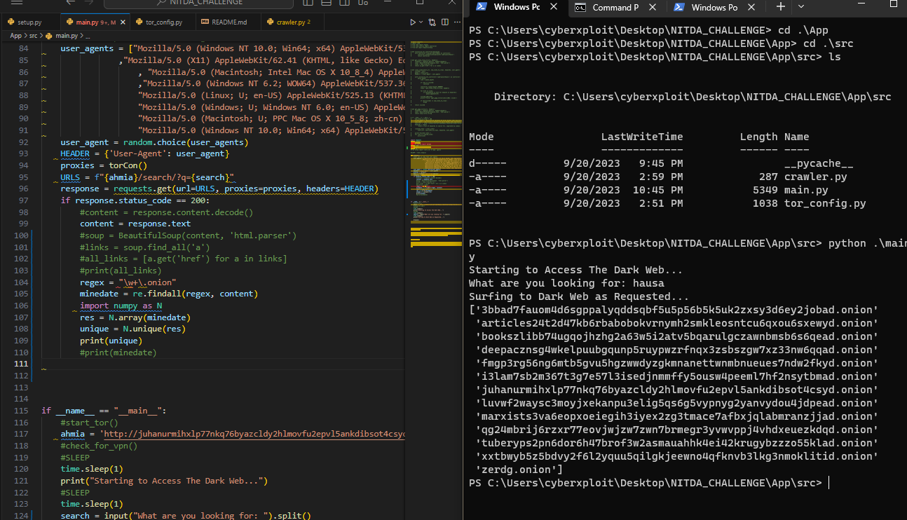

# NITDA_CHALLENGE DarkWeb Crawler


DarkWeb Crawler is a Python project that allows you to browse the dark web using the Tor network and perform web crawling to find .onion links based on specific keywords. This tool provides an interface for accessing the dark web securely and searching for content of interest.

## Features

- Access the dark web securely using the Tor network.
- Search for .onion links based on user-defined keywords.
- Utilize a variety of fake user agents to maintain anonymity.
- Extract and display unique .onion links from the search results.

## Prerequisites

- Python 3.x
- [Requests](https://pypi.org/project/requests/)
- [Beautiful Soup](https://pypi.org/project/beautifulsoup4/)
- [Tor](https://www.torproject.org/)

## Disclaimer
This project is intended for educational and research purposes only. Use it responsibly and ensure compliance with all legal and ethical guidelines when accessing the dark web.


## Challenge
```bash
Build advanced web crawling tools that navigate the dark web, collect relevant data, and provide organizations with insights into emerging threats and vulnerabilities. This tool should feature an analytics to process and categorize unstructured dark web data, providing actionable insights to security teams
```
## Challenge Outline
- ` Legal and Ethical Considerations`
    - Understand the legal and ethical implications of crawling the dark web. 
    - Ensure that i comply with all relevant laws and regulations, such as cybersecurity and privacy laws.
    - Consider ethical guidelines and principles to protect privacy and handle sensitive information appropriately.
- ` Project Scope and Objectives`
    - Determine what types of data i intend to collect and the specific insights i want to provide.
- ` Permissions and Access`
    - We need to make a proxies connection to Tor Network that will route the program to be able to access the DarkWeb. This can be achieve with Tor Browser, stem library (python).
    - Some areas of the dark web may require specific access methods or authorization.
- ` Technologies Used`
    - Python version 3
    - Tor Browser Tor Network
    - Microsoft Excel
- ` Data Collection`
    - Create web crawlers or spiders that can navigate the dark web, collect data from various sources (websites, forums, etc.), and store it securely.
- ` Data Processing and Analytics`
    - Implement data processing and analysis tools to make sense of the collected data. This may involve natural language processing (NLP) techniques, data categorization, and machine learning for identifying patterns or moreover using Microsoft Excel.
- ` Insights and Reporting`
    - Develop a system to generate actionable insights and reports based on the analyzed dark web data. 
    - Security teams should be able to understand emerging threats and vulnerabilities from the insights provided.
- ` Security Measures`
    - Prioritize security throughout the project. Protect the data i collect, use encryption where necessary, and establish secure communication channels.
- ` Testing and Validation`
    - Rigorously test the crawling, data processing, and analytics components to ensure accuracy and reliability. 
    - Use a variety of dark web sources to validate your results.
- ` Feedback and Improvement`
    - Encourage feedback from users and stakeholders to enhance the tool's capabilities and accuracy over time.

## INSTALLATION
You need to make sure that you have Tor installed on your Operating System. 
### LINUX
> For Linux users you can install Tor by:
```bash
sudo apt install tor
sudo service tor start
git clone https://github.com/cyberxploithausa/NITDA_CHALLENGE.git
cd NITDA_CHALLENGE
pip install -r requirements.txt
cd App/src
python main.py
```
### WINDOWS
> For Windows users you can download [Tor Browser](https://www.torproject.org) and it comes pre-packaged with Tor. You can find Tor.exe in (Desktop\TorBrowser\Browser\TorBrowser\Tor\tor.exe) and run it. After Starting Tor, Open a new CMD / Terminal and continue below:
```bash
git clone https://github.com/cyberxploithausa/NITDA_CHALLENGE.git
cd NITDA_CHALLENGE
pip install -r requirements.txt
cd App/src
python main.py
```

## TO-Dos
```bash
- Connect to Tor network and browse the dark web | status = Done
- Search for keywords base of a search engine | status = Done
- Crawl through the results and keep track of every link | status = Done
- Store the links of the crawled result in text file for now | status = Done
- Detect Threats and vulnerabilities of technologies
- Raise Alarm of the above
```